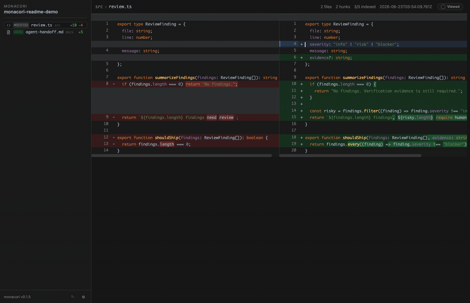

# monacori

**A local desktop review workspace for AI-generated code changes.**

Run `mo` after an AI edits your repository. monacori opens a side-by-side diff, lets you attach line-level questions or change requests, and bundles that feedback back into the AI CLI (command-line interface) session running in the built-in terminal.



## Why monacori

AI coding tools are fast, but their "done" message is not a review. monacori gives the human reviewer a dedicated control surface for the gap between generated code and trusted code:

- See every changed, added, and untracked file in an IntelliJ-style review sidebar.
- Review side-by-side diffs with syntax highlighting, changed-line emphasis, and keyboard navigation.
- Leave questions or change requests directly on the relevant line.
- Send all reviewer comments, with file paths and code context, into `claude`, `codex`, or another terminal session without copy-paste.
- Keep all generated review state local, plain, and inspectable under `.monacori/`.

## Workflow

1. Let an AI coding tool make changes in your repository.
2. Run `mo` from that repository.
3. Inspect the diff, mark files as viewed, and attach line comments where needed.
4. Open the built-in terminal and keep your AI CLI session beside the review.
5. Send the merged questions or change requests back to the session as a focused follow-up prompt.

The result is a tighter review loop: the AI produces changes, the human reviews the actual diff, and the next prompt is grounded in exact file and line context.

## Install

```bash
npm install -g @happy-nut/monacori
```

The short command is `mo`.

Homebrew users can install from the tap as well:

```bash
brew install happy-nut/monacori/monacori
```

## Quick Start

Inside any Git repository:

```bash
mo
```

On first run, `mo` creates `.monacori/`, adds it to `.gitignore`, and includes untracked files so new AI-created files appear immediately.

## Highlights

- **Desktop diff review**: reads the repository directly, refreshes from local Git state, and does not require a web server.
- **AI handoff comments**: questions and change requests are stored with their file, line, and code context.
- **Integrated terminal**: keep `claude`, `codex`, or a shell open inside the same window, with split panes when needed.
- **Source navigation**: jump between changed files, search indexed files, preview source, and move through hunks from the keyboard.
- **Plain local artifacts**: generated review files and state are Markdown, JSON, and static HTML under `.monacori/`.

## Commands

| Command | What it does |
| --- | --- |
| `mo` | Open the desktop diff-review app for the current repository. Alias for `monacori open`. |
| `monacori open` | Launch the review app, auto-initialize `.monacori/`, and include untracked files by default. |
| `monacori app` | Launch the same desktop app explicitly. |
| `monacori init` | Initialize `.monacori/` in the current directory. |
| `monacori install` | Initialize and write agent instruction snippets. Use `--apply-agent-docs` to patch `AGENTS.md` or `CLAUDE.md`. |

Useful review options:

```bash
mo --staged              # review only staged changes
mo --tracked-only        # exclude untracked files
mo --base main           # compare against a specific base
mo --context 20          # show more context around each hunk
```

## Local State

`monacori init` creates a git-ignored `.monacori/` directory for generated diff reviews, local config, comments, logs, and validation notes. Keep it ignored unless your team intentionally wants to version review artifacts.

## Design Principles

- Real diffs beat chat summaries.
- Human review should stay close to the code and the running AI session.
- The core should be local, inspectable, and agent-agnostic.
- No required terminal multiplexer, editor plugin, hosted service, or worktree strategy.

## License

MIT
