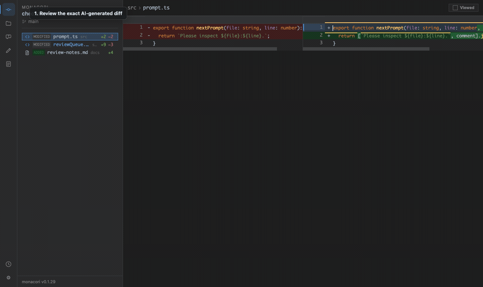

# monacori

**A local desktop review workspace for AI-generated code changes.**

Run `mo` after an AI edits your repository. monacori opens the real local diff, lets you inspect the surrounding project, attach line-level questions or change requests, and turn that evidence into a grounded follow-up prompt you can use with any AI tool.



## Why monacori

AI coding tools are fast, but their "done" message is not a review. monacori gives the human reviewer a dedicated control surface for the gap between generated code and trusted code:

- See every changed, added, and untracked file in an IntelliJ-style review sidebar.
- Review side-by-side diffs with syntax highlighting, changed-line emphasis, and keyboard navigation.
- Leave questions or change requests directly on the relevant line.
- Merge all reviewer comments with file paths and code context, then copy the grounded handoff into any AI tool.
- Keep all generated review state local, plain, and inspectable under `.monacori/`.

## Core Flow

monacori's core value is a grounded correction loop:

1. Review the exact Git diff produced by an AI coding tool.
2. Attach a question or change request on the relevant line.
3. Merge those comments into a prompt that includes file paths, line numbers, and code context.
4. Copy the prompt into the next AI turn so it starts from reviewed evidence, not a chat summary.

## Workflow

1. Let an AI coding tool make changes in your repository.
2. Run `mo` from that repository.
3. Inspect the diff, mark files as viewed, and attach line comments where needed.
4. Merge the questions or change requests into a focused prompt and copy it to your AI tool.

The result is a tighter review loop: the AI produces changes, the human reviews the actual diff, and the next prompt is grounded in exact file and line context.

## Install

```bash
npm install -g @happy-nut/monacori
```

The short command is `mo`.

## Quick Start

Inside any Git repository:

```bash
mo
```

On first run, `mo` creates `.monacori/`, adds it to `.gitignore`, and includes untracked files so new AI-created files appear immediately.

## Highlights

- **IntelliJ-style desktop diff review**: reads the repository directly, refreshes from local Git state, and presents editor-like Base/Working tree panes with change navigation, a live per-file change counter, center-aligned old/new line-number gutters, and hunk-spanning semantic bands (modified blue, deleted gray, added green).
- **AI handoff comments**: questions and change requests are stored with their file, line, and code context.
- **Grounded review handoff**: merge comments with exact file, line, and code context and copy them as one inspectable prompt.
- **Two-purpose source view**: use **Review** for line comments, then switch eligible code files to the lazy-loaded **Code** mode for a virtualized Monaco editor, folding, sticky scopes, and fast navigation. Starting a comment from Code returns to Review at the same caret.
- **Project-wide search**: `Cmd/Ctrl+Shift+F` shows occurrence-level `file:line:column` results using the bundled, VS Code-maintained [ripgrep package](https://github.com/microsoft/vscode-ripgrep); static HTML reviews retain a dependency-free local fallback.
- **LSP-first code intelligence**: definition/usages (`Cmd/Ctrl+B`), implementation (`Cmd/Ctrl+Alt+B`), and workspace-symbol search (`Cmd/Ctrl+Alt+O`) use a project language server when available. TypeScript/JavaScript also works out of the box through monacori's bundled background sidecar. Unsupported languages and unavailable servers fall back to the main-process regex index.
- **Semantic Peek**: multi-result definitions, references, and implementations stay in context in a split inspector with a result list, source preview, exact location, server provenance, project generation, and query duration. Open the selected result only when you are ready to leave the current file.
- **Change Impact**: place the caret on a changed symbol and press `Cmd/Ctrl+8` to inspect callers/importers, outgoing calls/dependencies, implementations/inheritance, related tests, and type/API/schema/config relationships.
- **Large-project isolation**: search, LSP sessions, and fallback indexing run outside the renderer. The UI receives compact result locations and loads source content one open file at a time.
- **Visible analysis trust**: the sidebar footer shows whether semantic analysis is starting, ready, failed, or using the heuristic fallback. Its tooltip includes the repository generation, selected server/source, and exact fallback reason.
- **Plain local artifacts**: generated review files and state are Markdown, JSON, and static HTML under `.monacori/`.

### Language servers

monacori is an LSP client rather than a language analyzer. It starts servers as repository-scoped background processes after the first review page loads, reuses them while that review window is open, and stops them with the window.

Resolution order is an explicit `MONACORI_LSP_<LANGUAGE>` override, a repository-local executable (`node_modules/.bin`, `.venv/bin`, `venv/bin`, or `bin`), monacori's bundled TypeScript/JavaScript sidecar, and finally the launch `PATH`. The bundled sidecar contains `typescript-language-server` plus a compatible TypeScript 6.x fallback; a reviewed repository's own compatible TypeScript installation remains preferred by the server.

Supported server commands are:

- TypeScript/JavaScript: `typescript-language-server`
- Python: `pyright-langserver` or `pylsp`
- Go: `gopls`; Rust: `rust-analyzer`; C/C++: `clangd`
- Java: `jdtls`; Kotlin: `kotlin-language-server`
- Ruby: `solargraph`; PHP: `intelephense`

To select a specific executable, set `MONACORI_LSP_<LANGUAGE>`, for example `MONACORI_LSP_TYPESCRIPT=/path/to/typescript-language-server`. If no matching server is available, navigation remains usable through the regex fallback. Change Impact labels its evidence as `semantic`, `semantic + heuristic`, or `heuristic` and identifies whether the active server came from the project, the bundle, an override, or `PATH`.

## Development

Working on monacori itself? The globally-installed `mo` runs the **published** package, not your
checkout — local edits won't appear until you build and run locally.

Run your checkout directly (builds, then launches in the foreground with DevTools open):

```bash
npm run dev
```

This reviews the monacori repo itself. To review **another repo** with your local build, pass `--cwd`:

```bash
npm run dev -- --cwd /path/to/other-repo
```

**Which build is running?** A dev build titles its window `monacori (dev)` and opens DevTools, and
every launch prints its app path — so a local checkout is distinguishable from the installed package
even when their version numbers match:

```text
monacori: launching /…/repos/monacori/dist/app-main.js                       # local checkout
monacori: launching /…/lib/node_modules/@happy-nut/monacori/dist/app-main.js  # installed package
```

Prefer the `mo` command pointed at your checkout? `npm link` once, then rebuild after each change:

```bash
npm link                              # global `mo` now runs this checkout
npm run build                         # rebuild dist/ after editing src/
npm unlink -g @happy-nut/monacori     # restore the published `mo`
```

The numbered `src/viewer/*.js` slices, `src/viewer.css`, and Monaco's production runtime are bundled/copied
into `dist/` by the build, so re-run `npm run build` (or `npm run dev`) after editing them.

Regenerate the README demo GIF from a temporary sample repository:

```bash
npm run demo:gif
```

Measure the lazy review build against a reproducible large-project fixture:

```bash
npm run benchmark
# tune the fixture when comparing a change
npm run benchmark -- --files 5000 --changed 200 --lines 120
```

The latest run is written to `.monacori/perf/benchmark.json`. Desktop sessions also write
`.monacori/perf/latest.json` with bounded startup, first-paint, Monaco load/readiness, analysis-status, and
query-duration events. Both are local plain JSON evidence; performance collection never leaves the machine.

### Tests

```bash
npm test
```

`npm test` builds, then runs the jsdom regression suite (`test/*.test.mjs`) against the built `dist/`.
It guards the core user flows end to end — see [test/USER_FLOWS.md](test/USER_FLOWS.md) — and the same
suite gates every release.

## Local State

Running `mo` creates a git-ignored `.monacori/` directory for generated diff reviews, local config, comments, logs, and validation notes. Keep it ignored unless your team intentionally wants to version review artifacts.

## Design Principles

- Real diffs beat chat summaries.
- Human review should stay close to the code and concrete project evidence.
- The core should be local, inspectable, and agent-agnostic.
- No required editor plugin, hosted service, worktree strategy, or agent-specific workflow.

## License

MIT
