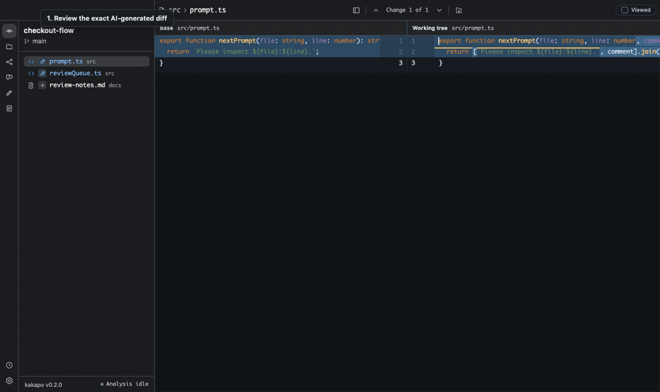

# Kakapo

**AI가 만든 코드를 로컬에서 끝까지 검증하는 데스크톱 리뷰 워크스페이스.**

Kakapo는 채팅의 완료 보고가 아니라 실제 Git 변경 사항, 주변 프로젝트 구조, 언어 서버의 의미 분석을 근거로 리뷰하게 해줍니다. AI가 코드를 수정한 저장소에서 `kakapo`를 실행하고, diff에 질문이나 변경 요청을 남긴 뒤 정확한 파일·라인 정보가 포함된 후속 프롬프트를 복사하면 됩니다.



## 핵심 흐름

1. AI가 만든 실제 Git diff를 확인합니다.
2. 변경 라인에 질문 또는 변경 요청을 남깁니다.
3. 코멘트를 `@경로#L행` 근거가 포함된 하나의 프롬프트로 합칩니다.
4. 그 프롬프트를 다음 AI 작업에 전달해 수정 결과를 다시 검토합니다.

프로젝트 안에 Kakapo 상태 파일을 만들지 않습니다. 메모, 코멘트, Viewed 상태, UI 상태와 성능 증거는 운영체제의 애플리케이션 데이터 디렉터리에 워크스페이스 절대 경로별로 격리됩니다.

## 주요 기능

- IntelliJ 스타일의 side-by-side diff, 접힌 문맥 확장, hunk 밴드와 F7 탐색
- 변경 파일, 일반 파일, untracked 파일을 포함하는 리뷰 트리
- 파일/프로젝트 검색과 번들된 ripgrep 기반 대형 저장소 검색
- LSP 우선 definition, references, implementation, workspace symbol 탐색
- 호출자·importer·구현체·테스트·타입/API 후보를 구분하는 Change Impact
- 코드 라인 질문/변경 요청과 편집 가능한 합본 프롬프트
- 워크트리별 단일 인라인 Markdown 메모
- 라인 Git 로그와 lane 기반 커밋 그래프
- Markdown, 이미지, HTTP Client 파일의 로컬 리뷰
- 메인 프로세스 검색·인덱싱과 지연 로딩을 통한 대형 프로젝트 대응

Kakapo는 언어 분석기를 새로 구현하지 않습니다. 배포 앱에는 TypeScript/JavaScript, Python, Go, Rust, C/C++, Java, Kotlin, Ruby, PHP용 language server와 필요한 런타임/toolchain이 함께 들어 있습니다. GUI 프로세스의 `PATH`를 탐색하지 않으며, 지원 밖의 언어나 서버가 의미 위치를 반환하지 못한 경우에만 출처가 표시된 정규식 인덱스로 폴백합니다. 프로젝트 검색용 ripgrep도 앱에 포함됩니다.

## 설치와 실행

### Linux 공식 빌드

Kakapo는 Linux x64와 ARM64를 공식 지원합니다. 모든 PR, `main` 변경, 릴리스에서 각 아키텍처의 네이티브 Ubuntu runner가 전체 테스트를 실행하고, Electron 앱을 패키징한 뒤 Xvfb에서 실제 Chromium 렌더러가 열리는 것까지 확인합니다. 이 검증을 통과한 압축 파일만 [GitHub Releases](https://github.com/happy-nut/kakapo/releases)에 게시됩니다.

릴리스에서 아키텍처에 맞는 `Kakapo-<version>-linux-x64.tar.gz` 또는 `Kakapo-<version>-linux-arm64.tar.gz`를 받은 뒤 실행합니다.

```bash
tar -xzf Kakapo-<version>-linux-x64.tar.gz
./Kakapo-linux-x64/Kakapo --cwd /path/to/repository/package
```

ARM64에서는 두 경로의 `x64`를 `arm64`로 바꾸면 됩니다. 배포 파일은 별도 시스템 Electron, Node.js, language server, JRE, PHP, Go/Rust toolchain 설치를 요구하지 않습니다.

### 소스 설치

소스 설치에는 Node.js 22.14 이상이 필요합니다.

소스에서 설치:

```bash
git clone https://github.com/happy-nut/kakapo.git
cd kakapo
npm install
npm run lsp:install
npm link
```

검토할 Git 저장소 또는 모노레포 내부 폴더에서 실행합니다.

```bash
kakapo
# 또는
kakapo --cwd /path/to/repository/package
```

모노레포 내부 폴더를 열면 Git revision은 상위 저장소에서 읽되 변경 목록, 검색, 소스 탐색과 상태는 선택한 폴더 범위로 제한됩니다.

### 비교 base 선택

기본값은 working tree를 자동 base와 비교합니다 — 브랜치에 아직 push하지 않은 커밋이 있으면 upstream의 merge-base를, 아니면 HEAD를 base로 잡습니다. AI 작업이 이미 커밋되어 있는 경우에는 비교 base를 직접 지정할 수 있습니다.

```bash
kakapo --base main          # working tree를 main과 비교 (AI 피처 브랜치 전체 리뷰)
kakapo --base v0.2.0        # 특정 태그와 비교
kakapo --base 9f3c1a2       # 특정 커밋과 비교
kakapo --staged             # 인덱스(스테이징)를 HEAD와 비교
```

`--base`는 브랜치·태그·커밋 어떤 revision이든 받고 실행 시점에 검증합니다. `--staged`와 `--base`는 함께 쓸 수 없습니다. 상단 리뷰 상태줄에 현재 비교 대상("working tree vs main", "staged changes")이 표시됩니다.

## 자주 쓰는 단축키

| 단축키 | 동작 |
| --- | --- |
| `Cmd/Ctrl+0` | Changes 패널로 포커스 이동 / 이미 포커스면 토글 |
| `Cmd/Ctrl+1` | Files 패널로 포커스 이동 / 이미 포커스면 토글 |
| `Cmd/Ctrl+F` | 현재 파일 또는 diff 안에서 검색 |
| `Cmd/Ctrl+Shift+F` | 프로젝트 전체 검색 |
| `F7` / `Shift+F7` | 다음 / 이전 diff hunk |
| `Space` | Changes 패널에서 선택된 변경 파일 Viewed 토글 |
| `Cmd/Ctrl+B` | definition 찾기 |
| `Cmd/Ctrl+Alt+B` | implementation 찾기 |
| `Cmd/Ctrl+8` | Change Impact |
| `Cmd/Ctrl+9` | Git History |
| `Cmd/Ctrl+.` | 현재 괄호 범위 접기 / 펼치기 |
| `Option/Alt+Enter` | 현재 항목의 컨텍스트 액션 |

전체 단축키 목록은 앱의 Settings > Keyboard Shortcuts에서 확인할 수 있습니다.

## 언어 서버

배포 앱은 다음 분석기를 앱 리소스에서 직접 실행합니다.

| 언어 | 내장 분석기 | 함께 포함되는 실행 환경 |
| --- | --- | --- |
| TypeScript / JavaScript | `typescript-language-server` | Electron의 Node 호스트 |
| Python | Pyright | Electron의 Node 호스트 |
| Go | `gopls` | Go SDK |
| Rust | `rust-analyzer` | Cargo, Rust stable, `rust-src` |
| C / C++ | `clangd` | 플랫폼 네이티브 clangd |
| Java | Eclipse JDT LS | Temurin JRE 21 |
| Kotlin | JetBrains 공식 Kotlin LSP | 전용 JetBrains Runtime |
| Ruby | Sorbet | 플랫폼 네이티브 Sorbet |
| PHP | Phpactor | 정적 PHP 8.4 런타임 |

정상 배포본에서는 이 번들이 항상 우선이며 셸의 `PATH`는 검색하지 않습니다. 개발자가 명시한 `KAKAPO_LSP_<LANGUAGE>` 실행 파일만 우선할 수 있고, 소스 체크아웃에서 번들을 아직 설치하지 않은 경우에 한해 저장소 로컬 실행 파일을 개발 폴백으로 허용합니다. 패키징은 9개 언어군의 번들 존재 여부와 실제 cross-file definition을 모두 검사한 뒤에만 진행됩니다.

언어 서버의 의미 분석 품질은 프로젝트 메타데이터에도 영향을 받습니다. Java/Kotlin은 Maven 또는 Gradle 모델, Rust는 `Cargo.toml`, Go는 `go.mod`, C/C++ 대형 프로젝트는 `compile_commands.json`, PHP는 Composer autoload 정보가 있으면 가장 정확합니다. 분석 캐시와 JDT/Kotlin workspace는 저장소 안이 아니라 운영체제 임시/애플리케이션 데이터 영역에 둡니다.

## 로컬 데이터

macOS에서 `/Users/me/repos/zoobox/turtle`을 열었다면 상태는 다음 위치에 저장됩니다.

```text
~/Library/Application Support/Kakapo/workspaces/Users/me/repos/zoobox/turtle/
├── memo.json
├── state.json
├── perf/
└── review/app-review.html
```

경로를 해시로 숨기지 않아 직접 확인할 수 있으며, 저장소 루트와 내부 패키지, 서로 다른 worktree를 동시에 열어도 각각 독립된 상태를 가집니다.

Linux에서는 같은 구조가 `${XDG_CONFIG_HOME:-~/.config}/Kakapo/workspaces/...` 아래에 저장됩니다.

## 개발

```bash
npm install
npm run lsp:install
npm run build
npm run lsp:smoke
npm test
npm run smoke
```

Linux 배포 파일을 만들고 실제 데스크톱 렌더러까지 검사:

```bash
npm run dist:linux:x64   # 또는 dist:linux:arm64
npm run smoke:linux
```

플랫폼별 optional dependency가 누락된 교차 빌드를 배포하지 않도록 Linux 패키지는 대상과 같은 아키텍처의 Linux 호스트에서만 생성됩니다. macOS에서 위 명령을 실행하면 불완전한 산출물을 만들지 않고 즉시 실패합니다.

다른 저장소를 로컬 빌드로 검토:

```bash
npm run dev -- --cwd /path/to/repository
```

README 실행 GIF 재생성:

```bash
npm run demo:gif
```

스크립트는 임시 Git 저장소에 실제 변경을 만들고 Kakapo 리뷰 화면을 Electron에서 실행한 뒤 프레임을 영상으로 인코딩하고 최종 GIF를 생성합니다.

성능 기준 측정:

```bash
npm run benchmark
npm run benchmark -- --files 5000 --changed 200 --lines 120
```

테스트는 실제 임시 Git 저장소와 빌드된 `dist/`를 사용해 diff, 검색, 코멘트, 메모, History, LSP 폴백, 상태 영속화와 Electron 레이아웃의 주요 사용자 흐름을 회귀 검증합니다. 세부 목록은 [test/USER_FLOWS.md](test/USER_FLOWS.md)에 있습니다.

## 설계 원칙

- 채팅 요약보다 실제 diff를 신뢰합니다.
- 확정된 영향과 확인 후보를 구분합니다.
- 리뷰 근거는 파일과 라인에 가깝게 둡니다.
- 상태는 로컬에 평문 Markdown/JSON/HTML로 보존합니다.
- 특정 AI, 에디터 플러그인, worktree 전략이나 호스팅 서비스에 종속되지 않습니다.

## License

MIT
