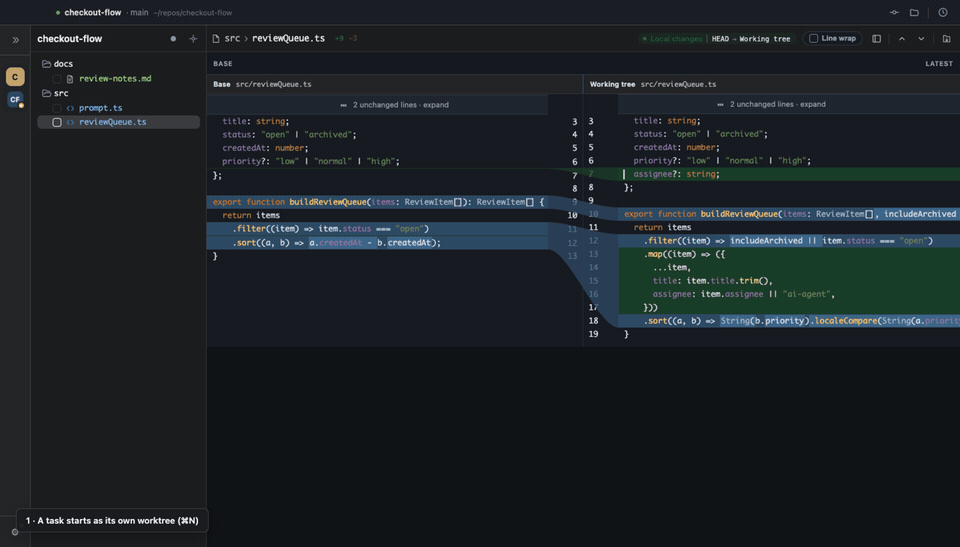

# Kakapo

**AI가 실제로 무엇을 바꿨는지 읽고, 그 리뷰를 그대로 AI에게 돌려주는 데스크톱 워크스페이스.**

*[English README](README.md)*

코딩 에이전트는 빠릅니다. 그 결과물을 읽는 쪽이 느리죠. Kakapo는 그 반쪽을 위해 만들어졌습니다 — 진짜 diff, 진짜 language server 탐색, 그리고 복사·붙여넣기 없이 에이전트가 직접 읽고 답할 수 있는 리뷰 대화.



## 왜 Kakapo인가

**근거는 채팅 로그가 아니라 diff입니다.** 에이전트의 "완료 ✅"는 주장일 뿐입니다. Kakapo는 실제 Git diff를 IntelliJ 스타일 side-by-side로 열고, 접힌 문맥을 펼치고, `F7`로 hunk를 넘기고, 파일별 *Viewed* 상태를 남깁니다. 보고된 내용이 아니라 들어온 변경을 봅니다.

**내 코멘트는 에이전트에게 가고, 답변은 그 라인 위로 돌아옵니다.** 라인에서 `?`를 눌러 질문이나 변경 요청을 남기고, `⌘⇧/`로 열린 코멘트를 하나의 요청으로 합칩니다. 요청은 `.git/kakapo/` 아래 파일로 쓰이고, 에이전트에게는 그 파일 경로 한 줄만 전달됩니다. 에이전트는 같은 스레드에 답을 append하고, 그 답은 내 코멘트 아래 대댓글로 붙습니다. 프롬프트를 손으로 조립할 일도, 붙여넣은 텍스트 벽을 스크롤할 일도 없습니다. `F8`로 열린 스레드를 끝까지 훑습니다.

**`⌘7`은 에이전트가 자기 diff를 설명하게 합니다.** 중요한 라인마다 쉬운 말로 노트 카드를 달고, 문제가 있는 지점과 그것이 해결되는 지점을 표시합니다. 코드베이스에 대해 알아낸 것은 `.git/kakapo/knowledge.jsonl`에 쌓여 저장소의 모든 worktree가 공유하므로, 다음 설명이 매번 백지에서 시작하지 않습니다.

**창 하나, 작업 하나당 worktree 하나.** `⌘N`은 `~/kakapo/workspaces/<repo>/<task>`에 관리되는 worktree를 만들고, base 브랜치를 먼저 fetch하고, 원하면 `claude`나 `codex`를 바로 그 안에서 실행합니다. 다른 워크스페이스로 옮겨도 에이전트는 백그라운드에서 계속 돕니다(tmux 기반이라 앱을 껐다 켜도 살아 있습니다). 왼쪽 rail이 어느 워크스페이스가 작업 중이고 어느 쪽이 나를 기다리는지 배지로 알려주고, 다른 워크스페이스에서 턴이 끝나면 시스템 알림이 옵니다. `⌘⌥1–9`로 즉시 전환합니다.

**설치 없이 IDE 수준으로 읽습니다.** definition·references·implementation·workspace symbol이 실제 language server로 diff 위에서 동작하고, Change Impact는 확정된 호출자·importer·구현체와 확인이 필요한 테스트·타입 후보를 구분합니다. 프로젝트 검색은 번들된 ripgrep으로 돌아갑니다. 9개 언어의 분석기와 실행 환경이 앱 안에 들어 있어 `PATH`도, 별도 설치도, 에디터 플러그인도 필요 없습니다.

**프로젝트 안에는 아무것도 쓰지 않습니다.** 리뷰 스레드는 `.git/kakapo/`에 있습니다 — git은 자기 디렉터리를 추적하지 않으니 `git status`는 깨끗하고, cwd에 갇힌 코딩 에이전트는 그 파일에 닿을 수 있습니다. 나머지 상태는 워크스페이스 절대 경로별로 OS 애플리케이션 데이터 디렉터리에 격리됩니다. 전부 평문 JSONL/Markdown/JSON, 완전 로컬, 계정도 텔레메트리도 없고 MIT입니다.

## 리뷰 루프

1. 워크스페이스 터미널(``⌃` ``)에서 에이전트가 작업합니다.
2. 실제 diff를 읽습니다 — `F7`로 hunk 이동, `Space`로 파일 확인 표시.
3. 라인에서 `?`로 질문하거나 변경을 요청합니다.
4. `⌘⇧/`로 합치고, `⌥Enter`로 에이전트에게 넘깁니다.
5. 에이전트가 고치고 그 자리에 답합니다. `F8`로 답변을 따라갑니다.

## 설치

### macOS (Apple Silicon)

[Releases](https://github.com/happy-nut/kakapo/releases)에서 `Kakapo-<version>-arm64.dmg`를 받습니다. 서명되지 않은 빌드라 첫 실행은 우클릭 → **열기**로 Gatekeeper를 통과해야 합니다.

### Linux (x64 / ARM64)

모든 PR, `main` 변경, 릴리스에서 각 아키텍처의 네이티브 Ubuntu runner가 전체 테스트를 돌리고, 앱을 패키징하고, Xvfb에서 실제 Chromium 렌더러가 열리는 것까지 확인합니다. 이 검증을 통과한 빌드만 게시됩니다.

```bash
tar -xzf Kakapo-<version>-linux-x64.tar.gz
./Kakapo-linux-x64/Kakapo --cwd /path/to/repository
```

ARM에서는 `x64`를 `arm64`로 바꿉니다. 별도의 Electron, Node.js, language server, JRE, PHP, Go/Rust toolchain을 설치할 필요가 없습니다.

### 소스에서

Node.js 22.14 이상이 필요합니다.

```bash
git clone https://github.com/happy-nut/kakapo.git
cd kakapo
npm install
npm run lsp:install
npm link
```

## 실행

Git 저장소나 모노레포 내부 패키지 폴더에서 실행합니다.

```bash
kakapo
kakapo --cwd /path/to/repository/package
```

Kakapo는 한 번만 실행됩니다. 다른 저장소나 worktree에서 다시 실행하면 기존 앱에 합류해 그 워크스페이스를 열고, 이미 열린 경로면 그 창으로 이동합니다. 하위 폴더는 Git top-level로 정규화되므로 같은 checkout이 두 번 열리지 않고, 서로 다른 worktree는 각각 독립된 워크스페이스로 남습니다.

### 워크스페이스

왼쪽 rail은 항상 자리에 있습니다. 위쪽 selector가 현재 repo·브랜치·활동 상태를 보여주고, `⌘K`(또는 클릭)로 워크스페이스 목록을 엽니다.

`⌘N`(또는 **New**)에서 이미 clone된 로컬 저장소와 작업 이름을 고르면 `~/kakapo/workspaces/<repo>/<slug>`에 `<prefix>/<slug>` 브랜치의 worktree가 만들어집니다. base는 `origin/HEAD` → `origin/main` → `origin/master` → `main` → `master` 순으로 찾아 먼저 fetch하며, 오프라인이면 로컬 base로 진행하고 경고를 남깁니다. fetch는 UI를 막지 않고 취소할 수 있습니다. 새 워크스페이스가 에이전트를 바로 실행하게 할 수도, 빈 터미널만 열어둘 수도 있습니다.

각 워크스페이스의 `⋯` 메뉴로 이름을 바꾸거나, 새 창으로 분리하거나, 목록에서 닫습니다. 생성된 worktree를 삭제할 때는 미커밋 변경·push하지 않은 커밋·실행 중인 터미널/에이전트를 각각 경고하고, 브랜치는 기본적으로 남깁니다. 메인 checkout은 닫기만 가능합니다. 앱을 다시 열면 목록과 마지막 활성 워크스페이스가 복원되고, 경로가 사라진 항목은 조용히 지우지 않고 `disconnected`로 남습니다. Claude나 Codex 실행이 감지된 세션은 rail에서 resume할 수 있습니다.

### 비교 대상 고르기

기본값은 working tree를 자동 base와 비교합니다 — push하지 않은 커밋이 있으면 upstream의 merge-base, 아니면 `HEAD`. 에이전트 작업이 이미 커밋되어 있다면 base를 직접 지정합니다. 툴바에서 고르거나, 실행할 때 넘길 수 있습니다.

```bash
kakapo --base main          # working tree vs main (AI 피처 브랜치 전체 리뷰)
kakapo --base v0.2.0        # 특정 태그와 비교
kakapo --base 9f3c1a2       # 특정 커밋과 비교
kakapo --staged             # 인덱스 vs HEAD
```

`--base`는 어떤 revision이든 받고 실행 시점에 검증합니다. `--staged`와는 함께 쓸 수 없습니다. 상단 상태줄에 현재 비교 대상이 표시됩니다. 앱 안에서는 patch set 선택기로 브랜치의 특정 커밋 하나와 비교할 수 있고, `⌘9`로 커밋 그래프를 열어 Enter를 누르면 그 커밋이 메인 리뷰에서 열립니다.

## 단축키

| 키 | 동작 |
| --- | --- |
| `⌘K` / `⌘N` | 워크스페이스 전환 / 새 worktree 만들기 |
| `⌘⌥1–9` | 해당 워크스페이스로 이동 |
| `⌘0` / `⌘1` | 변경사항 / 파일 패널 |
| `F7` / `⇧F7` | 다음 / 이전 변경 hunk |
| `Space` | 선택한 변경 파일 Viewed 토글 |
| `?` | 현재 라인에 코멘트 |
| `⌘⇧/` | 전체 리뷰 코멘트 (합본 요청, `⌥Enter`로 전송) |
| `F8` / `⇧F8` | 다음 / 이전 코멘트·Explain 노트 |
| `⌘7` | Explain — 에이전트가 이 diff에 설명을 달게 함 |
| `⌘8` / `⌘9` | 변경 영향 / Git 히스토리 |
| `⇧⇧` / `⌘F` / `⌘⇧F` | 파일 찾기 / 파일 안 검색 / 프로젝트 검색 |
| `⌘B` / `⌘⌥B` / `⌘⌥O` | definition·usages / implementation / workspace symbol |
| ``⌃` `` / `⌘D` | 터미널 토글 / 패널 분할 |
| `⌘⇧P` / `⌘⇧N` | 프롬프트 팔레트 / 프롬프트 메모 |
| `⌘,` | 설정 |

나머지는 설정 ▸ 단축키에 있습니다.

## 내장 language server

| 언어 | 분석기 | 함께 들어 있는 실행 환경 |
| --- | --- | --- |
| TypeScript / JavaScript | `typescript-language-server` | Electron의 Node 호스트 |
| Python | Pyright | Electron의 Node 호스트 |
| Go | `gopls` | Go SDK |
| Rust | `rust-analyzer` | Cargo, Rust stable, `rust-src` |
| C / C++ | `clangd` | 플랫폼 네이티브 clangd |
| Java | Eclipse JDT LS | Temurin JRE 21 |
| Kotlin | JetBrains Kotlin LSP | 전용 JetBrains Runtime |
| Ruby | Sorbet | 플랫폼 네이티브 Sorbet |
| PHP | Phpactor | 정적 PHP 8.4 런타임 |

배포본은 항상 자기 번들을 우선하며 셸의 `PATH`는 뒤지지 않습니다. 명시한 `KAKAPO_LSP_<LANGUAGE>` 실행 파일만 이를 덮어쓸 수 있고, 번들을 아직 설치하지 않은 소스 체크아웃에서만 저장소 로컬 실행 파일을 개발 폴백으로 허용합니다. 패키징은 9개 번들의 존재와 실제 cross-file definition을 모두 확인한 뒤에만 진행됩니다. 지원 밖 언어이거나 서버가 답하지 못하면, 출처가 표시된 정규식 인덱스로 폴백합니다.

의미 분석의 품질은 프로젝트 메타데이터에도 달려 있습니다 — Java/Kotlin은 Maven·Gradle 모델, Rust는 `Cargo.toml`, Go는 `go.mod`, 큰 C/C++ 프로젝트는 `compile_commands.json`, PHP는 Composer autoload. 분석 캐시와 JDT/Kotlin workspace는 저장소 안이 아니라 임시·앱 데이터 영역에 둡니다.

## 상태가 저장되는 곳

리뷰 스레드와 누적된 코드베이스 노트는 저장소의 git 디렉터리 안에 있습니다.

```text
.git/worktrees/<name>/kakapo/comments.jsonl   # 이 워크스페이스의 리뷰 대화
.git/kakapo/knowledge.jsonl                   # 모든 worktree가 공유하는 코드베이스 노트
```

나머지는 워크스페이스 절대 경로별로 OS 앱 데이터 디렉터리에 미러링됩니다. macOS에서 `/Users/me/repos/acme/turtle`을 열었다면:

```text
~/Library/Application Support/Kakapo/workspaces/Users/me/repos/acme/turtle/
├── memo.json
├── state.json
├── perf/
└── review/app-review.html
```

경로를 해시로 숨기지 않아 직접 열어볼 수 있고, 저장소 루트·내부 패키지·다른 worktree를 동시에 열어도 각각 독립된 상태를 가집니다. Linux에서는 같은 구조가 `${XDG_CONFIG_HOME:-~/.config}/Kakapo/workspaces/...` 아래에 있습니다.

## 개발

```bash
npm install
npm run lsp:install
npm run build
npm run lsp:smoke
npm test
npm run smoke
```

로컬 빌드로 다른 저장소를 검토:

```bash
npm run dev -- --cwd /path/to/repository
```

Linux 패키지 생성과 실제 렌더러 확인:

```bash
npm run dist:linux:x64   # 또는 dist:linux:arm64
npm run smoke:linux
```

플랫폼별 optional dependency가 빠진 교차 빌드를 배포하지 않도록, Linux 패키지는 대상과 같은 아키텍처의 Linux 호스트에서만 만들어집니다. macOS에서 실행하면 불완전한 산출물을 만들지 않고 바로 실패합니다. macOS 빌드는 `npm run dist:mac:dmg`로 만듭니다.

README GIF는 `npm run demo:gif`로 다시 만들고, 성능은 `npm run benchmark`(`-- --files 5000 --changed 200 --lines 120`으로 더 큰 합성 저장소)로 측정합니다.

테스트는 실제 임시 Git 저장소와 빌드된 `dist/`를 사용해 diff, 검색, 코멘트, 메모, 히스토리, LSP 폴백, 상태 영속화, Electron 레이아웃을 회귀 검증합니다. 사용자 흐름 목록은 [test/USER_FLOWS.md](test/USER_FLOWS.md)에 있습니다.

## 설계 원칙

- 채팅 요약보다 실제 diff를 신뢰합니다.
- 확정된 영향과 확인이 필요한 후보를 구분합니다.
- 리뷰 근거는 파일과 라인 곁에 둡니다.
- 상태는 로컬에 평문 Markdown/JSON/JSONL로 남깁니다.
- 특정 AI, 에디터 플러그인, worktree 전략, 호스팅 서비스에 종속되지 않습니다.

## 라이선스

MIT
