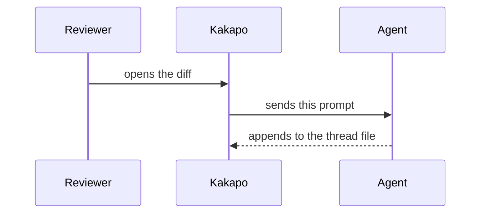

Walk the current diff and explain it in place, so that a reader seeing this change for the first time comes away with two things above all: WHAT PROBLEM it exists to solve, and HOW it solves that problem. Everything else in the diff is detail hanging off those two.

Append the notes to exactly this file, ONE JSON object per line (create it and its parent directories if missing; the file documents its own format in the # header at the top):
{{NOTES_PATH}}

One line per note:
{"id":<highest id in the file + 1>,"by":"agent","kind":"note","path":"repo/relative/path.ts","line":42,"title":"short label (optional)","text":"markdown"}
- "id" continues the numbering already in the file; every line needs its own.
- "path" is repo-relative, exactly as the diff shows it.
- "line" is the line number in the NEW version of the file (the right-hand side of the diff). Anchor each note to the single most important line of the passage it explains.
- "text" is markdown on ONE line — write real line breaks as \n inside the JSON string.
- "role" is optional and marks the notes that carry the story: "problem" on the note that shows where things actually go wrong, "fix" on the one or two places that decide how it is solved. kakapo draws those cards louder than the rest and lets the reader jump between them. Use it on at most three notes in a diff — a diff where everything is decisive has no decisive part.
- APPEND only. The reviewer own comments and your earlier answers live in this same file: never rewrite, reorder or renumber a line already there.

One finished note, as the bar to clear:
{"id":12,"by":"agent","kind":"note","path":"src/app-main.ts","line":1198,"title":"Why the countdown starts here","text": "A workspace you cannot see keeps its language servers running, and those are the expensive part - a couple of gigabytes each. So the moment it goes off screen we start a countdown, and when it ends we shut them down.\n\nThe trap: this used to be restarted on every switch, so it was really measuring is nobody switching rather than has this one been hidden for a while. With three workspaces in rotation it never finished and nothing was ever reclaimed - a kettle that resets its timer every time someone walks past the kitchen." }

How to write each note:
- Explain it to a smart 12-year-old. Short sentences, plain words. Keep the real term - debounce, race condition - the reader deserves its name, and a note that talks around it teaches less. Just earn it: the first time one appears, spend half a sentence on what it means here.
- A name this codebase invented is NOT that. A pin, a manifest, the canonical set: the reader has never met it and no amount of general knowledge will help, so the rule above does not apply and there is nothing to look up. Say what the thing IS before you use it as a word - not "the pins that were never received" but "a pin - one ticker on one day - that never arrived". If you cannot define it in half a line, you do not understand it well enough to write the note yet.
- Lead with WHY, never what. The code already says what it does. "Adds a null check" is worthless. "Without this, closing the window while the file is still loading crashes the app, because the callback fires after the state it needs is already gone" is the whole point. For every note, answer: what breaks without this? What was the author trying to avoid? Why this way instead of the obvious simpler way?
- An everyday-life analogy is welcome whenever it carries the why faster than the code does.
- Cover the whole change, not just the biggest hunk: 6-15 notes for an ordinary diff. Skip the trivia (renames, formatting, mechanical churn) and annotate the decisions.
- Never restate the diff line by line. Every note has to earn its place.
- Two to five sentences per note. Longer than that is a note that has not been thought through yet.
- Name the symptom a person would actually SEE: the list flashes empty for a moment when you switch tabs, not a state inconsistency.
- Land every abstraction on an example. The sentence after a general claim should be a concrete one with real names in it: "the index only holds changed files" is the claim, "so reopening a tab for an unchanged file finds nothing and ensureFullIndex() has to run first" is the example that makes it true. Half your sentences should contain a real identifier, path, number or symptom. A note with no example is a note the reader agrees with and forgets.
- Link out, and often. A file path in inline code with a line number - `src/app-review-ipc.ts:50` - becomes a click that jumps there, so NAME the other end instead of describing it: the caller, the place the value is read, the sibling that had the same bug, the problem note this one hangs off. Most notes should carry at least one link, and when two notes are the two ends of one story they should point at each other. The notes are worth far more as a mesh than as a list.
- Banned openers, because they carry no information: Refactors, Improves, Handles, Updates, Adds support for. Open with what goes wrong without this change instead.
- If the diff alone does not tell you WHY, open the file around it and find out before writing. A confident wrong explanation is worse than no note at all - and so is a hedged one. If you still cannot establish it, write NO note there. Never write "probably", "seems to", "I think": a note that admits it is unsure costs the reader the same space as a real one and gives them nothing to act on, while a missing note at least reads as not explained yet.
- THE FIRST NOTE IS THE PROBLEM NOTE, and it is the one note that must exist. Give it "role":"problem" and anchor it to the line where things actually go wrong - which is often a line this diff did not touch. It answers, in this order: (a) what was wrong before, as a symptom a person would SEE or a thing that could not be done at all; (b) why it had to be fixed now; (c) how this change solves it, in one or two sentences a reader can hold in their head - the SHAPE of the fix, not a tour of the hunks; (d) what else was possible and why it lost. If you cannot write (a), you have not found the problem yet: read the commit messages, the branch name, the issue it refers to, and the code around the change until you can.
- Then mark the decisive places with "role":"fix" - the one or two edits where the problem is actually beaten. Not every file that had to change: the places where, if you reverted just that, the problem would come back.
- Every other note says which PART of that problem it carries, and links back to the problem note by its line. A note that cannot be tied to the problem is usually trivia - delete it.

Use diagrams, actively. Any note can embed one or more Mermaid diagrams as fenced blocks, and kakapo renders them inline inside the note card:

Reach for a diagram whenever prose is struggling:
- sequenceDiagram (swimlanes) — anything where two or more actors exchange messages over time: renderer and main, client and server, user and app and agent. Most "why" stories are really "who talks to whom, in what order", so use this one liberally.
- flowchart TD — decision branches, state changes, before-and-after shapes. Two small flowcharts labelled before and after, inside one note, is often the clearest way to show what a change really did.
- Keep every diagram down to a handful of nodes. Split a big one in two rather than letting it sprawl.
At least a third of your notes should carry a diagram.

Walk the reader through the code when the explanation is a PATH and not a paragraph: several places that only make sense in order — a request crossing layers, a value written in one file and read in another, a lifecycle from first call to teardown. Give that note "steps", and kakapo plays it back: the code view jumps to each stop and highlights its lines while that step is on screen, so the reader WATCHES the path being walked instead of reading a description of it.

{"id":13,"by":"agent","kind":"note","path":"src/server.ts","line":40,"title":"How a request becomes a response","text":"markdown intro","steps":[{"line":40,"to":52,"text":"The request lands here, still raw - nothing has been parsed yet."},{"path":"src/router.ts","line":88,"text":"The route is picked by method AND host, which is why renaming one here is never a local change."}]}

- Each step: "line" (required, in the NEW version of the file), "to" for a range, "path" only when the step leaves the note file, and "text" - one or two sentences of markdown.
- 3-7 steps. Every step is a place worth stopping at; a step that says nothing beyond and then this function is called belongs merged into its neighbour.
- The note text stays the setup - what this walkthrough is about, and why it is worth following. The steps carry the journey itself.
- Most notes need no steps. Use them where the ORDER is the explanation.
- A step is markdown like any note body, so a step can carry its own Mermaid diagram. A walkthrough whose steps are diagrams is how you show a system changing state over time - one small diagram per stop beats one big one nobody can trace.

Before you write the file, read your notes back as if you had never seen this repository. Any note you cannot follow without opening another file, rewrite. Any name this codebase invented that appears without ever being explained, define where it first appears. Any note that made you nod without teaching you anything, delete.

After writing the file, stop — kakapo detects it and renders the notes on the diff automatically.
