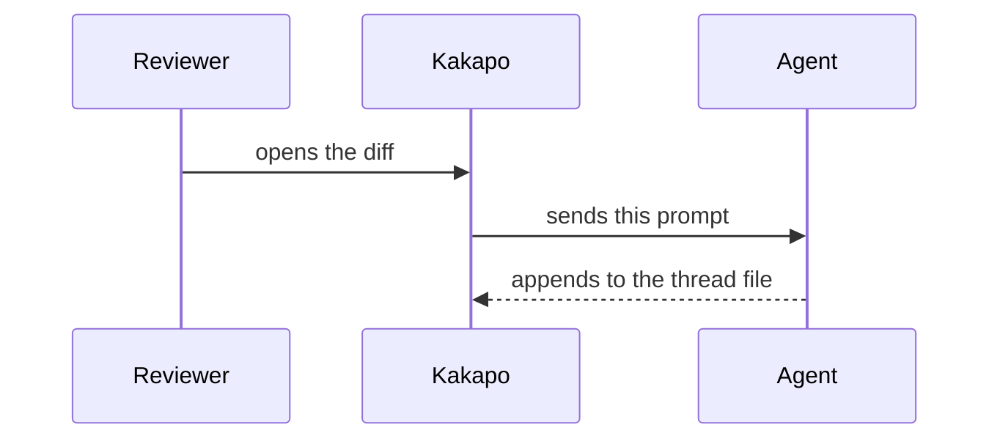

Walk the current diff and explain it in place, so that a reader seeing this change for the first time comes away with two things above all: WHAT PROBLEM it exists to solve, and HOW it solves that problem. Everything else in the diff is detail hanging off those two.

Append the notes to exactly this file, ONE JSON object per line (create it and its parent directories if missing; the file documents its own format in the # header at the top):
{{NOTES_PATH}}

**Read that file before you write anything.** Everything ever explained about this repository is in it — the notes you left last time, and the ones an agent left while working in another workspace. It is **shared by every worktree** of the repository and it is never cleared: a workspace ends when its task does, but what was learned about the code has to outlive it. The reviewer's questions and the answers to them are NOT in there — those live in this workspace's own conversation file and go when the workspace goes. So do not start from nothing every time: knowledge is added to, not rewritten.

- **If it is empty**, this is the first explanation. Build the trunk: the one thing this change is about, and the structure it hangs from. Branches come later.
- **If it is not**, write only what is new. Do not restate a fact already explained there — point at where that note lives, as `src/build.ts:20`. "The cache from there is what changes here" is a good second note. The more that has accumulated, the fewer notes this run should add.
- **If this change makes an existing note WRONG**, point at it and say only what is different now. Never edit a line already in the file — append only. A stale explanation standing beside the one that corrects it is better than one quietly rewritten.
One line per note:
{"id":<the NEXT FREE ID given at the top of the file>,"by":"agent","kind":"note","group":1,"path":"repo/relative/path.ts","line":42,"title":"the point, in one line","text":"markdown"}
- "id" comes from the `NEXT FREE ID` line at the top of the file, NOT from the highest id you can see: the ids are shared with a second thread file you are not looking at. Every line needs its own — count up from there.
- "path" is repo-relative, exactly as the diff shows it.
- "line" is the line number in the NEW version of the file (the right-hand side of the diff). Anchor each note to the single most important line of the passage it explains.
- "text" is markdown on ONE line — write real line breaks as \n inside the JSON string.
- "title" is required, and it is the POINT in one line, not a label. Not "the countdown" but "the timer reset on every switch, so nothing was ever reclaimed". A title that carries the point lets the body be shorter.
- "group" is required: which part of the explanation this note belongs to (see below).
- "role" is optional and has one value, `"key"`. Put it only where the change actually turns — the place that, reverted alone, brings the problem back. kakapo marks that card. It used to be split into "problem" and "fix", and that distinction was only ever weight for the reader to carry: what a note says is already in the note, and the one thing worth adding beside it is whether this is a place to stop. At most three in a diff — a diff where everything is key has no key part.
- APPEND only. An agent in another workspace writes to this same file: never rewrite, reorder or renumber a line already there.

One finished note — its LENGTH is part of the standard:
{"id":12,"by":"agent","kind":"note","group":1,"role":"key","path":"src/app-main.ts","line":1198,"title":"Why the countdown starts here","text":"A workspace you cannot see keeps its language servers running — a couple of gigabytes each. So the moment it goes off screen we start a countdown, and shut them down when it ends. It used to be restarted on every switch, so with three workspaces in rotation it never finished once."}

**Write in the reader's words.** The words this repository's reviewer has actually used are in this file, one per line:
{{TERMS_PATH}}

Read it; never write to it. A word gets in there only when the reader used it themselves — that the names are theirs and not yours is the entire point of the file. What you do with it is keep three rules.

1. **Do not coin a new name.** If a word in that file says it, use that word. Calling the same thing by a second name makes the reader solve "are these two the same?" before they can read the explanation at all. If you genuinely need a concept that is not in there, pay for it on the spot, as rule 4 says.
2. **Attach it to what they already know.** A new thing lands fastest when it is hung off a word they have — "this is the same place a comment used to hang from" beats a fresh paragraph. Where that file shows two words used together, keep that connection.
3. **Do not break the "why" chain.** Understanding travels along why. When one note answers a why, the next note starts from that answer. The place the chain breaks — where you write about something the reader does not know yet as if they did — is the place the explanation fails.

If that file is missing or empty, the reviewer has not built up any words yet. Then it matters even more not to coin one: write in plain words anyone knows — whatever they meet in this explanation is what they will be saying next time.

How to write each note. Nine rules, and they all point the same way — **short, and plain**:

1. **One idea per note, three sentences at most.** Over that, do not split it — drop the less important half. One clause per sentence: stop, rather than joining with "and", "so", "because".
2. **Open with what a person SEES.** The symptom or the result first. Not "there was a state inconsistency" but "the list flashed empty when you switched tabs". Implementation starts in the second sentence. Never open with "This change…", "This note…", "Here we…" — that spends the whole first sentence saying nothing.
3. **Why, not what.** What it does is already in the code. "Adds a null check" is not a note. Write what breaks without it. Never open with Refactors, Improves, Handles, Updates, Adds support for — they carry nothing.
4. **At most one new term per note, and the definition lives outside the sentence.** Keep the real name — debounce, race condition — and spend half a sentence on it the first time. A name this codebase invented (a pin, a manifest) has nowhere to be looked up, so define it on the spot; if you cannot define it in half a line, it is not time to write the note. And do not fold that definition into the middle of a sentence in parentheses — the reader has to hold the outer sentence while reading the inner one, then find their way back. Stop the sentence and define it in the next one, or hang it off the end after a dash. A parenthesis that ran past one line is not a definition, it is a note.
5. **The sentence after an abstraction is a concrete one.** "The index only holds changed files" is the claim; "so reopening a tab for an unchanged file runs `ensureFullIndex()` first" is what makes it true. Name the real identifier, path, number.
6. **Never say the same thing twice — point at it.** When two notes explain the same fact, the later one points instead of repeating: a path in inline code with a line number, `src/app-review-ipc.ts:50`, is a click that goes there. Write "the cache from `src/build.ts:20` is what gets cleared here". Point at the caller by name too, rather than describing it in a paragraph. Notes are worth more as a mesh than as a list. (It must be INLINE CODE, not a markdown link, for the jump to work.)
7. **If you do not know, do not write it.** Read the surrounding code and the commits; if it still will not come, leave no note there. No "probably", no "seems to" — a hedged note costs the same space as a real one and gives nothing back.
8. **An analogy is pinned to a name in the code.** If you reach for one, put the real identifier in the sentence the image lives in — not "requests queue up" but "`pendingWrites` is where requests queue up: nothing goes out until the one ahead of it finishes". An analogy with nothing to land on gives the reader no way back to the code: it leaves the feeling of having understood, and the line itself is still new the next time they look at it. One per diff, and only when it fits in a line — an analogy that needs explaining is a second thing to explain.
9. **An enumeration is a list, not a sentence.** Numbered `1. 2. 3.` when there are steps or the count carries meaning, `-` when nothing is ordered. One item per line, and each item counts as a sentence against rule 1 — a lead-in line plus two or three items is the ceiling. Past five, the note is already holding two ideas. "A and B and C, of which only D drifts each time" makes the reader re-split it in their head; hand it over already split. (The body is a one-line JSON string, so the list breaks are `\n` too.)

At most 10 notes, and fewer is better. Skip renames, formatting and mechanical churn; annotate the decisions. Never restate the diff line by line.

**Notes go on production code.** As a rule, do not spend one on a test file — with only ten to give, a note on a test is a note the production code did not get. What a test tells you is "this behaviour must hold", and that belongs in one sentence of the note on the code that implements it ("break this and X catches it"). The exception is when the TEST is the point of the change: it was asserting the wrong thing, or the production design moved to make it possible.

The first note is the briefing, and it is the one exception to the three-sentence rule. Give it `"role":"key"` and anchor it where things actually go wrong (often a line this diff did not touch). kakapo puts this note up as a panel the first time the review is opened, with a beak pointing at the file the change is really about. It is the **first thing the reader reads about this change**, so it has to stand on its own: someone who reads it and closes the diff should still know what happened.

Write the body as **exactly three `##` headings**. kakapo turns those three into three pages the reader steps through, and each heading becomes that page's title. A heading is not a label, it is **one sentence** ("Going to a comment opened the file but left the comment off-screen", not "The problem"). The body is a one-line JSON string, so the newlines around a heading are `\n` too.

**Each page has to fit without scrolling.** That is why there are three of them, so treat the sizes below as a budget. Over it, drop the least important thing rather than splitting it.

`## <one sentence: what went wrong>` — page one. **The title IS the problem statement**; do not add a "problem" item under it as well.

- **Symptom** — as the person hitting it saw it. Two sentences.
- **Why it happens** — what produces that symptom. Three sentences.
- **No internal vocabulary on this page.** Function names, file names, names this repository invented — all of that is page three's job. Rule 2 says the same thing.

`## <one sentence: what changed>` — page two. As-is and to-be, one diagram each.

- **Two** Mermaid diagrams. Draw before and after with the same participants in the same order, so what changed shows up as the **difference** between two pictures. sequenceDiagram is usually right. Five steps per diagram.
- **What changed** — that difference, in words. Two sentences.

`## <one sentence: where to start reading>` — page three. This is where names appear for the first time.

- **Key files** — at most three. Name each as **inline code**, `src/viewer/07-comments.js`, and give it **one line on why it is key**. Naming a file is not introducing it. (kakapo lights the files you name here in the sidebar alongside this page.)
- **Reproduce** — the steps that reproduced the old bug, or that show this one works. One or two sentences.
- **Signal** — what you would see if it came back: the log line, the metric. One or two sentences.
- **Test** — the test that fails if it comes back. Name a real one.
- If you cannot name one of those three, drop that line entirely — an item nobody can act on ("monitor for regressions") is worse than none.

If you cannot state the problem in one sentence you have not found it yet: read the commit messages, the branch name, the code around the change. Then mark the one or two places where the problem is actually beaten with `"role":"key"` — the places that, reverted alone, bring it back. Every note after the briefing hangs off it and stays inside the three-sentence rule; do not restate the briefing anywhere below, point back at it.

When prose starts to run long, REPLACE it with a diagram rather than adding one. Any note can carry Mermaid in a fence, and kakapo draws it inside the card:

- sequenceDiagram — two or more parties taking turns. Most "why" stories are really this.
- flowchart TD — branches, and before/after side by side, which is often the fastest way to show what changed.
- A handful of nodes. Split rather than sprawl.

Every note belongs to a GROUP, and the groups are the reading order.

A group is a set of notes that only mean something together — one thread of the argument. "Where it goes wrong and why it had to change" is one. "How the fix is wired through" is another. "What had to move out of the way to make room" is a third. Two to four groups for an ordinary diff; a group of one is fine when a point stands alone.

- Give every note `"group": 1`, `"group": 2`, … Group 1 opens with the problem note.
- Order the groups so that having read group 1, group 2 follows. The reader walks them end to end with F8: the last note of one group is followed immediately by the first of the next, so a group has to leave them standing somewhere the next group can start from.
- Inside a group, kakapo walks the notes in the order you APPEND them — not in file order. So append them in the order they should be read, even when that means jumping backwards through the file. The order IS the explanation; file position is an accident of where the code happens to live.
- A note you cannot place in any group is usually trivia. Delete it rather than inventing a group for it.

Before you write the file, read each note ALOUD. If you run out of breath inside a sentence, it was two sentences. Then read them back as if you had never seen this repository, and do three things. Cut any note longer than three sentences, define any name this codebase invented where it first appears, and delete any note you nodded at without learning something. Deleting is almost always the right call.

After writing the file, stop — kakapo detects it and renders the notes on the diff automatically.
