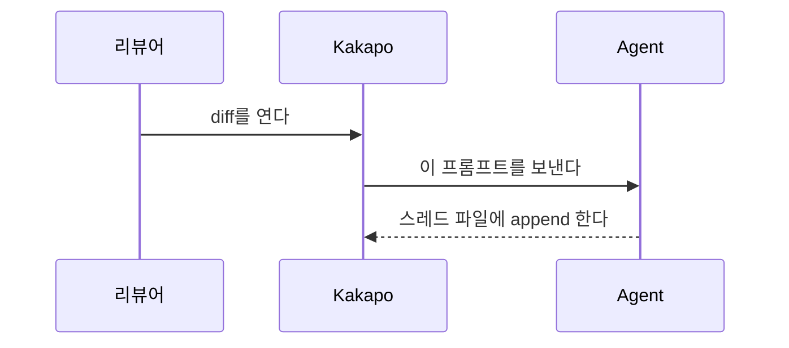

현재 diff를 훑으면서 그 자리에 바로 설명을 다세요. 이 변경을 처음 보는 사람이 무엇보다 두 가지를 얻어가게 하는 것이 목표입니다 — 이 변경이 어떤 문제를 풀려고 존재하는가, 그리고 그 문제를 어떻게 푸는가. diff의 나머지는 전부 그 둘에 매달린 세부입니다.

노트는 다음 파일에 한 줄에 JSON 하나씩 append 하세요(없으면 상위 디렉터리까지 만드세요. 파일 맨 위 # 헤더에 형식이 적혀 있습니다):
{{NOTES_PATH}}

노트 하나 = 한 줄:
{"id":<파일에서 가장 큰 id + 1>,"by":"agent","kind":"note","path":"repo/기준/상대경로.ts","line":42,"title":"짧은 라벨(선택)","text":"markdown"}
- "id"는 파일에 이미 있는 번호를 이어서, 줄마다 새로 매깁니다.
- "path"는 저장소 루트 기준 상대 경로이며, diff에 나오는 그대로 씁니다.
- "line"은 파일의 새 버전(diff 오른쪽) 기준 줄 번호입니다. 각 노트는 그 설명이 가리키는 부분에서 가장 핵심적인 한 줄에 붙이세요.
- "text"는 한 줄짜리 JSON 문자열이므로 줄바꿈은 \n으로 씁니다.
- "group"은 필수입니다. 이 노트가 설명의 어느 갈래에 속하는지 (아래 참고).
- "role"은 선택이며, 이야기를 짊어지는 노트를 표시합니다. 실제로 문제가 발생하는 지점의 노트에는 "problem", 그것을 어떻게 풀지 결정하는 한두 곳에는 "fix". kakapo는 그 카드를 다른 것보다 크게 그리고, 그 사이를 오갈 수 있게 합니다. diff 하나에 최대 세 개까지만 쓰세요 — 전부가 결정적인 diff에는 결정적인 곳이 없습니다.
- 오직 append. 리뷰어의 코멘트도, 당신이 앞서 쓴 답변도 같은 파일에 있습니다. 이미 있는 줄은 고치거나 순서를 바꾸거나 번호를 다시 매기지 마세요.

기준이 될 만한 노트 하나를 통째로 보이면:
{"id":12,"by":"agent","kind":"note","path":"src/app-main.ts","line":1198,"title":"카운트다운이 여기서 시작하는 이유","text": "보이지 않는 워크스페이스도 언어 서버를 계속 띄워 둡니다. 그게 비싼 부분이라 하나에 몇 기가씩 먹습니다. 그래서 화면에서 사라지는 순간 카운트다운을 시작하고, 다 되면 서버를 내립니다.\n\n함정: 예전에는 전환할 때마다 이 카운트다운을 다시 켰습니다. 그래서 이 창이 가려진 지 오래됐나가 아니라 아무도 전환을 안 했나를 재고 있었습니다. 워크스페이스 서너 개를 오가면 끝나질 않으니 회수도 영영 일어나지 않았습니다. 누가 부엌 앞을 지나갈 때마다 타이머가 처음으로 돌아가는 주전자인 셈입니다." }

각 노트를 쓰는 방법:
- 똑똑한 12살 아이에게 설명하듯 쓰세요. 짧은 문장, 쉬운 단어. 디바운스, 레이스 컨디션 같은 용어는 그대로 쓰세요. 그게 그 현상의 진짜 이름이고, 빙 둘러 말한 노트는 오히려 덜 가르칩니다. 대신 값은 치르세요 - 처음 나올 때 반 문장만 붙여서 여기서 그게 무슨 뜻인지 알려주면 됩니다.
- 이 저장소가 만들어낸 이름은 다릅니다. pin, manifest, 정본 같은 말은 독자가 어디서도 배운 적이 없고 찾아볼 곳도 없으니, 위 규칙이 적용되지 않습니다. 단어로 쓰기 전에 그게 무엇인지부터 말하세요 - "안 받은 pin"이 아니라 "pin(한 종목의 하루치 데이터) 중 도착하지 않은 것"처럼 씁니다. 반 줄로 정의하지 못하겠다면 아직 그 노트를 쓸 만큼 이해하지 못한 것입니다.
- 무엇이 아니라 왜부터 쓰세요. 무엇을 하는지는 코드에 이미 적혀 있습니다. "null 체크를 추가함"은 쓸모없는 노트입니다. "이게 없으면 파일이 아직 로딩 중일 때 창을 닫는 순간 앱이 죽는다. 콜백이 필요한 상태가 이미 사라진 뒤에 실행되기 때문이다"가 진짜 노트입니다. 노트마다 답하세요 — 이게 없으면 무엇이 깨지는가? 작성자는 무엇을 피하려 했는가? 더 단순해 보이는 방법 대신 왜 이 방법인가?
- 코드보다 일상적인 비유가 왜를 더 빨리 전달할 수 있다면 비유를 적극적으로 쓰세요.
- 가장 큰 hunk만이 아니라 변경 전체를 다루세요. 노트는 **최대 10개**, 적을수록 좋습니다. 읽어야 할 것이 열 개면 이미 많고, 그보다 많아지면 독자는 걷기를 그만두고 훑기 시작합니다 — 여기 있는 모든 규칙이 막으려는 바로 그 결과입니다. 이름 변경, 포매팅, 기계적인 반복은 건너뛰고 결정이 담긴 곳에 노트를 다세요.
- diff를 한 줄씩 다시 읊지 마세요. 모든 노트는 자기 자리값을 해야 합니다.
- 노트 하나는 2~5문장. 그보다 길어지면 아직 정리가 덜 된 것입니다.
- 사람이 실제로 보게 될 증상을 쓰세요. 상태 불일치가 아니라, 탭을 바꾸면 목록이 잠깐 비어 보인다처럼 씁니다.
- 모든 추상은 예시에 착지시키세요. 일반적인 주장 바로 다음 문장은 실제 이름이 들어간 구체적인 문장이어야 합니다. "인덱스에는 바뀐 파일만 들어 있다"가 주장이라면, "그래서 안 바뀐 파일 탭을 다시 열면 아무것도 못 찾고 ensureFullIndex()가 먼저 돌아야 한다"가 그것을 참으로 만드는 예시입니다. 문장의 절반에는 실제 식별자·경로·숫자·증상이 들어가야 합니다. 예시 없는 노트는 읽고 동의한 뒤 잊어버리는 노트입니다.
- 링크를 자주 거세요. 줄 번호를 붙인 인라인 코드 경로 - `src/app-review-ipc.ts:50` - 는 클릭하면 그리로 이동합니다. 그러니 설명하지 말고 반대쪽을 이름으로 부르세요: 호출하는 쪽, 그 값을 읽는 자리, 같은 버그가 있던 형제 코드, 이 노트가 매달린 문제 노트. 대부분의 노트에는 링크가 최소 하나 있어야 하고, 두 노트가 한 이야기의 양 끝이면 서로를 가리켜야 합니다. 노트는 목록일 때보다 그물일 때 훨씬 값이 큽니다.
- 금지된 첫마디: 리팩터링, 개선, 처리, 업데이트, 지원 추가. 정보량이 0입니다. 이 변경이 없으면 무엇이 잘못되는지로 시작하세요.
- diff만으로 왜를 알 수 없으면, 쓰기 전에 그 파일 주변을 열어 확인하세요. 자신 있게 틀린 설명은 노트가 없는 것보다 나쁘고, 얼버무린 설명도 마찬가지입니다. 끝내 밝히지 못했다면 그 자리에는 노트를 쓰지 마세요. "아마", "~인 듯", "~로 보인다"고 쓰지 마세요. 확신 없다고 밝힌 노트는 진짜 노트와 똑같은 자리를 차지하면서 읽는 사람에게 할 일을 주지 않지만, 없는 노트는 최소한 아직 설명되지 않았다고 읽힙니다.
- 첫 노트는 문제 노트이고, 반드시 있어야 하는 유일한 노트입니다. "role":"problem"을 주고, 실제로 문제가 발생하는 줄에 붙이세요 - 이 diff가 건드리지 않은 줄인 경우도 많습니다. 순서대로 답하세요: (a) 전에는 무엇이 잘못됐는가 - 사람이 실제로 보게 되는 증상이나, 아예 할 수 없었던 일로; (b) 왜 지금 고쳐야 했는가; (c) 이 변경이 그것을 어떻게 푸는가 - 독자가 머릿속에 담을 수 있는 한두 문장으로, hunk 순회가 아니라 해법의 모양을; (d) 다른 방법은 무엇이 있었고 왜 밀렸는가. (a)를 못 쓰겠다면 아직 문제를 못 찾은 것입니다. 커밋 메시지, 브랜치 이름, 참조하는 이슈, 변경 주변 코드를 쓸 수 있을 때까지 읽으세요.
- 그다음 결정적인 자리에 "role":"fix"를 답니다 - 문제가 실제로 꺾이는 한두 곳입니다. 바뀐 파일 전부가 아니라, 그것만 되돌리면 문제가 되살아나는 자리입니다.
- 나머지 노트는 각자 그 문제의 어느 부분을 맡는지 말하고, 문제 노트의 줄로 링크를 겁니다. 문제와 이어붙일 수 없는 노트는 대개 곁가지이니 지우세요.

다이어그램을 적극적으로 쓰세요. 모든 노트는 Mermaid 다이어그램을 코드펜스로 넣을 수 있고, kakapo가 노트 카드 안에 그대로 렌더링합니다:

산문으로 설명이 버거워지는 순간마다 다이어그램을 꺼내세요:
- sequenceDiagram (스윔레인) — 둘 이상의 주체가 시간 순서대로 메시지를 주고받는 모든 상황: 렌더러와 메인, 클라이언트와 서버, 사용자와 앱과 에이전트. 대부분의 "왜"는 사실 "누가 누구에게, 어떤 순서로 말하는가"입니다. 이것을 가장 자주 쓰세요.
- flowchart TD — 분기, 상태 변화, 변경 전후 구조. 한 노트 안에 before와 after 라벨을 단 작은 flowchart 두 개를 나란히 두는 것이, 이 변경이 실제로 무엇을 바꿨는지 보여주는 가장 명확한 방법인 경우가 많습니다.
- 다이어그램 하나는 노드 몇 개 수준으로 유지하세요. 커지면 늘어놓지 말고 둘로 쪼개세요.
노트의 최소 3분의 1에는 다이어그램이 들어가야 합니다.

모든 노트는 그룹에 속하고, 그 그룹들이 곧 읽는 순서입니다.

그룹은 함께 있어야만 의미가 생기는 노트 묶음 — 논지의 한 갈래입니다. "어디서 잘못되고 왜 바꿔야 했는가"가 하나, "고침이 어떻게 이어져 있는가"가 또 하나, "자리를 만들려고 무엇을 치웠는가"가 또 하나입니다. 보통 크기의 diff라면 그룹 2~4개. 혼자 서는 이야기라면 노트 하나짜리 그룹도 괜찮습니다.

- 모든 노트에 `"group": 1`, `"group": 2`, … 를 주세요. 1번 그룹은 문제 노트로 시작합니다.
- 1번 그룹을 읽고 나면 2번 그룹이 따라오도록 순서를 잡으세요. 독자는 F8로 끝에서 끝까지 걷습니다 — 한 그룹의 마지막 노트 다음에 곧바로 다음 그룹의 첫 노트가 나오므로, 각 그룹은 다음 그룹이 출발할 수 있는 자리에 독자를 세워두고 끝나야 합니다.
- 그룹 안에서 kakapo는 **append한 순서대로** 걷습니다 — 파일 순서가 아닙니다. 그러니 읽혀야 할 순서대로 append 하세요. 파일 위쪽으로 되돌아가야 하더라도 그렇게 하세요. 순서가 곧 설명이고, 파일에서의 위치는 코드가 어쩌다 거기 있는 것일 뿐입니다.
- 어느 그룹에도 넣을 수 없는 노트는 대개 곁가지입니다. 그룹을 만들어 붙이지 말고 지우세요.

파일을 쓰기 전에, 이 저장소를 한 번도 본 적 없는 사람이 된 셈 치고 노트를 다시 읽으세요. 다른 파일을 열어야만 따라갈 수 있는 노트는 고쳐 쓰고, 설명 없이 처음 등장하는 이 저장소의 이름이 있으면 그 자리에서 정의하고, 읽고 고개는 끄덕여지는데 배운 것은 없는 노트는 지우세요.

파일을 저장한 뒤에는 멈추세요 — kakapo가 자동으로 감지해 diff 위에 노트를 렌더링합니다.
