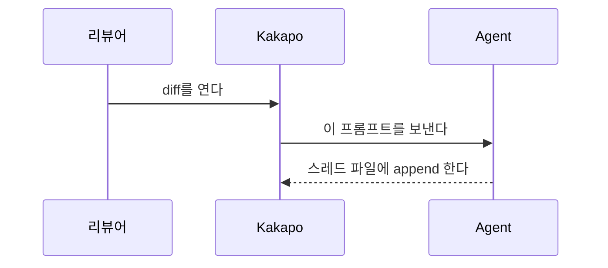

현재 diff를 훑으면서 그 자리에 바로 설명을 다세요. 이 변경을 처음 보는 사람이 무엇보다 두 가지를 얻어가게 하는 것이 목표입니다 — 이 변경이 어떤 문제를 풀려고 존재하는가, 그리고 그 문제를 어떻게 푸는가. diff의 나머지는 전부 그 둘에 매달린 세부입니다.

노트는 다음 파일에 한 줄에 JSON 하나씩 append 하세요(없으면 상위 디렉터리까지 만드세요. 파일 맨 위 # 헤더에 형식이 적혀 있습니다):
{{NOTES_PATH}}

**쓰기 전에 이 파일을 먼저 읽으세요.** 이 워크스페이스에서 지금까지 설명된 것이 전부 거기 있습니다 — 당신이 예전에 남긴 노트, 리뷰어의 질문, 그에 대한 답까지. 이 파일은 워크스페이스마다 따로 쌓이고 지워지지 않습니다. 그러니 매번 처음부터 설명하지 마세요. 지식은 더해지는 것이지 다시 쓰이는 것이 아닙니다.

- **비어 있다면** 이번이 첫 설명입니다. 줄기부터 세우세요 — 이 변경의 핵심 하나와 그것이 걸려 있는 구조. 곁가지는 다음 기회에 붙습니다.
- **이미 있다면** 새로 알게 된 것만 쓰세요. 거기서 이미 설명된 사실은 다시 쓰지 말고 그 노트가 붙은 자리를 `src/build.ts:20` 처럼 가리키세요 — "거기서 말한 그 캐시가 이번에 이렇게 바뀝니다"가 좋은 두 번째 노트입니다. 쌓인 것이 많을수록 이번에 더할 것은 적어야 정상입니다.
- **이번 변경이 기존 노트를 틀리게 만들었다면**, 그 노트를 가리키면서 무엇이 달라졌는지만 쓰세요. 이미 있는 줄은 절대 고치지 마세요 — 오직 append입니다. 틀려진 설명과 그것을 바로잡는 설명이 나란히 있는 것이, 조용히 고쳐진 설명보다 낫습니다.
노트 하나 = 한 줄:
{"id":<파일에서 가장 큰 id + 1>,"by":"agent","kind":"note","group":1,"path":"repo/기준/상대경로.ts","line":42,"title":"요점 한 줄","text":"markdown"}
- "id"는 파일에 이미 있는 번호를 이어서, 줄마다 새로 매깁니다.
- "path"는 저장소 루트 기준 상대 경로이며, diff에 나오는 그대로 씁니다.
- "line"은 파일의 새 버전(diff 오른쪽) 기준 줄 번호입니다. 각 노트는 그 설명이 가리키는 부분에서 가장 핵심적인 한 줄에 붙이세요.
- "text"는 한 줄짜리 JSON 문자열이므로 줄바꿈은 \n으로 씁니다.
- "title"은 필수이고, 라벨이 아니라 **요점 한 줄**입니다. "카운트다운"이 아니라 "전환할 때마다 타이머가 리셋돼서 회수가 안 됐다". 제목이 요점을 지고 있으면 본문은 그만큼 짧아도 됩니다.
- "group"은 필수입니다. 이 노트가 설명의 어느 갈래에 속하는지 (아래 참고).
- "role"은 선택이며, 이야기를 짊어지는 노트를 표시합니다. 실제로 문제가 발생하는 지점의 노트에는 "problem", 그것을 어떻게 풀지 결정하는 한두 곳에는 "fix". kakapo는 그 카드를 다른 것보다 크게 그리고, 그 사이를 오갈 수 있게 합니다. diff 하나에 최대 세 개까지만 쓰세요 — 전부가 결정적인 diff에는 결정적인 곳이 없습니다.
- 오직 append. 리뷰어의 코멘트도, 당신이 앞서 쓴 답변도 같은 파일에 있습니다. 이미 있는 줄은 고치거나 순서를 바꾸거나 번호를 다시 매기지 마세요.

기준이 될 만한 노트 하나 — 길이까지 이게 기준입니다:
{"id":12,"by":"agent","kind":"note","group":1,"role":"problem","path":"src/app-main.ts","line":1198,"title":"카운트다운이 여기서 시작하는 이유","text":"워크스페이스를 가려도 언어 서버는 계속 떠 있습니다 — 하나에 몇 기가씩 먹습니다. 그래서 화면에서 사라지면 카운트다운을 걸고, 끝나면 내립니다. 예전에는 전환할 때마다 타이머를 다시 켜서, 서너 개를 오가는 동안 한 번도 끝나지 않았습니다."}

각 노트를 쓰는 방법. 규칙은 아홉 개뿐이고, 전부 같은 곳을 가리킵니다 — **짧게, 쉽게**:

1. **한 노트에 한 가지 생각, 3문장 이내.** 넘으면 쪼개지 말고 덜 중요한 것을 버리세요. 문장 하나에 절 하나 — "~하고, ~해서, ~때문에"로 잇지 말고 끊으세요.
2. **첫 문장은 사람이 보는 것.** 증상이나 결과부터 씁니다. "상태 불일치가 있었다"가 아니라 "탭을 바꾸면 목록이 잠깐 비어 보였다". 구현 이야기는 그다음 문장부터. "이 변경은", "이 노트에서는", "여기서는" 같은 자기지시로 시작하지 마세요 — 첫 문장을 통째로 버리는 셈입니다.
3. **무엇이 아니라 왜.** 무엇을 하는지는 코드에 적혀 있습니다. "null 체크 추가"는 노트가 아닙니다. 이게 없으면 무엇이 깨지는지를 쓰세요. 리팩터링·개선·처리·업데이트·지원 추가로 시작하지 마세요 — 정보량이 0입니다.
4. **새 용어는 한 노트에 하나까지, 정의는 문장 밖에.** 디바운스, 레이스 컨디션 같은 진짜 이름은 그대로 쓰되 처음 나올 때 반 문장으로 값을 치르세요. 이 저장소가 만들어낸 이름(pin, manifest 같은)은 독자가 찾아볼 곳이 없으니 반드시 그 자리에서 정의하고, 반 줄로 정의 못 하면 아직 쓸 때가 아닙니다. 그리고 그 정의를 **괄호로 문장 한가운데 접어 넣지 마세요** — 독자는 바깥 문장을 머리에 든 채 안쪽을 읽고 나서 원래 자리로 돌아와야 합니다. 문장을 끊고 다음 문장에서 정의하거나, 줄표로 문장 끝에 답니다. 괄호가 한 줄을 넘겼다면 그건 정의가 아니라 노트 하나입니다.
5. **추상 다음 문장은 구체.** "인덱스에는 바뀐 파일만 있다"가 주장이면, "그래서 안 바뀐 파일 탭을 열면 `ensureFullIndex()`가 먼저 돌아야 한다"가 그것을 참으로 만듭니다. 실제 이름·경로·숫자를 부르세요.
6. **같은 말을 두 번 쓰지 말고 가리키세요.** 두 노트가 같은 사실을 설명하고 있으면, 뒤에 오는 쪽은 그 사실을 다시 쓰는 대신 앞 노트를 가리킵니다 — 줄 번호를 붙인 인라인 코드 경로 `src/app-review-ipc.ts:50` 는 클릭하면 그리로 갑니다. "`src/build.ts:20`에서 말한 그 캐시가 여기서 비워집니다"처럼 쓰세요. 호출하는 쪽도 문단으로 묘사하지 말고 이름으로 가리키고요. 노트는 목록일 때보다 그물일 때 값이 큽니다. (마크다운 링크가 아니라 **인라인 코드**여야 이동이 됩니다.)
7. **모르면 쓰지 마세요.** diff만으로 왜를 모르겠으면 주변 코드와 커밋을 읽고, 그래도 못 밝히면 그 자리에는 노트를 두지 마세요. "아마", "~인 듯"은 금지 — 얼버무린 노트는 진짜 노트와 같은 자리를 차지하면서 아무것도 주지 않습니다.
8. **비유는 코드의 이름에 못 박으세요.** 쓸 거면 그것이 무엇을 가리키는지 같은 문장 안에서 실제 이름으로 붙입니다 — "요청이 줄을 선다"가 아니라 "`pendingWrites`에 요청이 줄을 선다: 앞의 것이 끝나야 다음이 나갑니다". 붙일 이름이 없는 비유는 독자에게 코드로 돌아올 길을 주지 않습니다. 이해한 기분만 남기고, 정작 그 줄을 다시 보면 처음부터입니다. 한 diff에 하나까지, 한 줄로 끝날 때만 — 설명이 필요한 비유는 그 자체가 두 번째 설명거리입니다.
9. **열거는 문장으로 잇지 말고 목록으로.** 단계가 있거나 개수가 의미를 지면 `1. 2. 3.`, 순서가 없으면 `-`. 한 항목은 한 줄이고, 항목 하나가 규칙 1의 한 문장으로 칩니다 — 리드 한 줄에 항목 두셋이 상한입니다. 다섯을 넘으면 그 노트는 이미 두 가지 생각을 들고 있는 겁니다. "A이고 B이며 C인데 그중 D만 매번 달라져서"처럼 붙여 쓴 열거는 읽는 사람이 머릿속에서 도로 쪼개야 합니다. 쪼개서 건네세요. (본문은 한 줄짜리 JSON 문자열이므로 목록의 줄바꿈도 `\n` 입니다.)

노트는 최대 10개, 적을수록 좋습니다. 이름 변경·포매팅·기계적인 반복은 건너뛰고 결정이 담긴 곳에만 답니다. diff를 한 줄씩 다시 읊지 마세요.

**노트는 프로덕션 코드에 답니다.** 테스트 파일에는 원칙적으로 달지 마세요 — 열 개뿐인 자리를 테스트에 쓰는 건 아깝습니다. 테스트가 말해주는 것은 "이 동작이 지켜져야 한다"인데, 그건 그 동작을 구현한 프로덕션 쪽 노트에서 한 문장으로 하면 됩니다("이게 깨지면 X 테스트가 잡는다"). 예외는 **테스트 자체가 변경의 요점일 때**뿐입니다 — 잘못된 것을 검증하고 있었다거나, 그 테스트를 위해 프로덕션 설계가 바뀐 경우.

첫 노트는 문제 노트입니다. `"role":"problem"`을 주고 실제로 문제가 발생하는 줄에 붙이되(이 diff가 건드리지 않은 줄인 경우가 많습니다), 여기서도 3문장입니다: 전에는 무엇이 잘못됐는가 / 이 변경이 그것을 어떻게 푸는가 / 왜 다른 방법이 아닌가. 문제를 한 문장으로 못 쓰겠다면 아직 못 찾은 것이니, 커밋 메시지와 브랜치 이름과 주변 코드를 먼저 읽으세요. 그다음 문제가 실제로 꺾이는 한두 곳에 `"role":"fix"`를 답니다 — 그것만 되돌리면 문제가 되살아나는 자리입니다.

말이 길어질 것 같으면 다이어그램으로 **바꾸세요**. 덧붙이는 게 아니라 대신 쓰는 것입니다. 모든 노트는 Mermaid를 코드펜스로 넣을 수 있고 kakapo가 카드 안에 그려줍니다:

- sequenceDiagram — 둘 이상이 순서대로 주고받는 이야기. 대부분의 "왜"가 사실 이것입니다.
- flowchart TD — 분기와 전후 비교. before/after 두 개를 나란히 두는 게 가장 빠를 때가 많습니다.
- 노드 몇 개까지. 커지면 둘로 쪼개세요.

모든 노트는 그룹에 속하고, 그 그룹들이 곧 읽는 순서입니다.

그룹은 함께 있어야만 의미가 생기는 노트 묶음 — 논지의 한 갈래입니다. "어디서 잘못되고 왜 바꿔야 했는가"가 하나, "고침이 어떻게 이어져 있는가"가 또 하나, "자리를 만들려고 무엇을 치웠는가"가 또 하나입니다. 보통 크기의 diff라면 그룹 2~4개. 혼자 서는 이야기라면 노트 하나짜리 그룹도 괜찮습니다.

- 모든 노트에 `"group": 1`, `"group": 2`, … 를 주세요. 1번 그룹은 문제 노트로 시작합니다.
- 1번 그룹을 읽고 나면 2번 그룹이 따라오도록 순서를 잡으세요. 독자는 F8로 끝에서 끝까지 걷습니다 — 한 그룹의 마지막 노트 다음에 곧바로 다음 그룹의 첫 노트가 나오므로, 각 그룹은 다음 그룹이 출발할 수 있는 자리에 독자를 세워두고 끝나야 합니다.
- 그룹 안에서 kakapo는 **append한 순서대로** 걷습니다 — 파일 순서가 아닙니다. 그러니 읽혀야 할 순서대로 append 하세요. 파일 위쪽으로 되돌아가야 하더라도 그렇게 하세요. 순서가 곧 설명이고, 파일에서의 위치는 코드가 어쩌다 거기 있는 것일 뿐입니다.
- 어느 그룹에도 넣을 수 없는 노트는 대개 곁가지입니다. 그룹을 만들어 붙이지 말고 지우세요.

파일을 쓰기 전에 각 노트를 소리 내어 읽어 보세요. 한 문장을 읽다가 숨이 차면 그 문장은 두 개여야 합니다. 그다음 이 저장소를 한 번도 본 적 없는 사람이 된 셈 치고 다시 읽으면서, 세 가지를 하세요. 3문장을 넘는 노트는 잘라내고, 설명 없이 처음 나오는 이 저장소의 이름은 그 자리에서 정의하고, 읽고 고개는 끄덕여지는데 배운 것이 없는 노트는 지우세요. 지우는 쪽이 거의 항상 맞습니다.

파일을 저장한 뒤에는 멈추세요 — kakapo가 자동으로 감지해 diff 위에 노트를 렌더링합니다.
